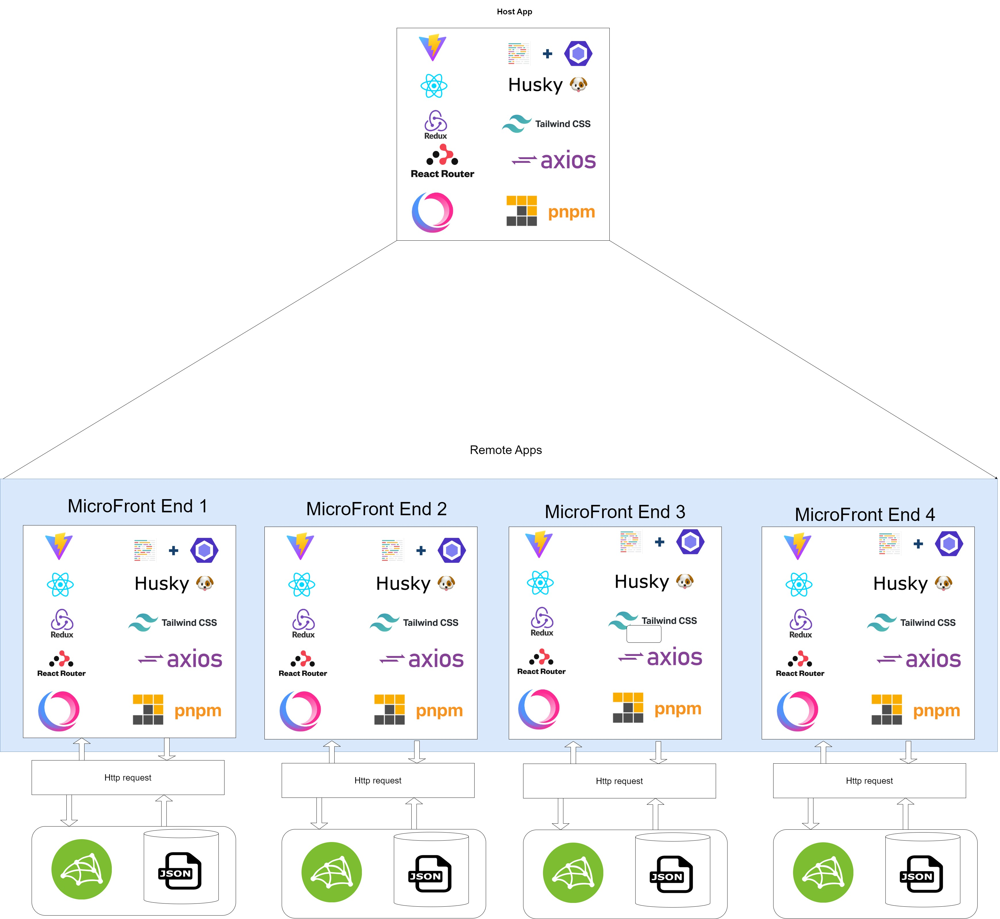

# Micro Frontends Implementation with React +Vite

Micro-frontend architecture is a front-end development approach that divides a monolithic codebase into smaller apps, each addressing a specific business vertical. Micro frontends work by breaking the frontend of an application into smaller and self-contained micro frontends. Each module is responsible for a specific feature or function and can be developed, tested, and deployed independently.


### Benefits of micro frontends
- Independent implementations
    - Each team has the freedom to make architectural decisions tailored to their specific module.
    - Micro frontends reduce inter-team dependencies, which often slow down development in monolithic projects. 
- Higher performance
    - Monolithic applications typically load the entire codebase, including components that users may not immediately need. In contrast, micro frontends load specific modules on demand. This optimized loading minimizes initial loading times, contributing to a smoother and faster user experience.
    - By loading only the necessary components, micro frontends reduce resource wastage and enhance the overall performance of web applications.
-  Faster Development
    - Changes or additions within a specific function or module no longer necessitate re-implementing the entire application. 
    - Smaller, self-contained modules are easier to maintain. 
-  Reliability
    - Micro frontends offer a robust and fault-tolerant architecture. If one module encounters issues or needs maintenance, the rest of the application can continue functioning seamlessly
    - The reliability of micro frontends translates into a better user experience. Users can continue using unaffected parts of the application even when certain modules are undergoing updates or maintenance.
-  Scalability
     - Micro frontends facilitate scalability at the module level. When specific parts of the application experience increased demand, you can scale those modules independently, ensuring a responsive and efficient user experience.
     - As our project grows, adding new teams or resources is straightforward with micro frontends. Each team can take ownership of a specific module, ensuring that the application can expand seamlessly to meet evolving requirements.
- Technology agnosticism
    - With micro-frontends, the design is not tied to any particular technology. Components written in various languages and frameworks (JavaScript, React, Vue, Angular, etc.) are supported. There is no need to stress about setting them up or constructing them.
- Reusability
    - The ability to implement code in several contexts is imminent. In this scenario, just a single module will be developed and released, but many teams will use it.

##### Let’s look at some of the most common micro frontend approaches.


###### Routing: loading separate applications
- The idea behind this approach is that the application is separated based on routing and each route loads a completely independent application, including framework bundles inside. In this case, infrastructure works as a shell, and redirects between applications happen through e.g., ```API gateway or CDN```.
###### NPM packages approach
- Each micro frontend is released as an individual package with the node package manager (NPM) approach. The shell application then lists these packages and incorporates them into the overall application. This approach offers the advantage of a fairly simple setup. However, it comes with certain drawbacks, such as the requirement for single-dependency versions and the inability to release a micro frontend without a shell release, which may create cross-team dependencies and hinder updates
###### Iframe-based micro frontend
- The iframe approach embeds each micro frontend in its own iframe, and a single page application (SPA) acts as the container. It is basically an HTML document put inside another HTML document. SPA is coordinating communication between iframes.
Iframes is a relatively old approach to building a micro frontend architecture. Even though it provides a good level of separation, many problems need to be solved for it to work (e.g., security, data sharing).

###### WebComponents
- Web components imply building each micro frontend as an isolated component that can be deployed independently as a .js file. The application loads and renders them in the placeholders specially created in the layout. Web components tell the browser when and where to create a component.
The drawback of this approach is that each web component is large and needs to bundle its framework version. So even though you can separate as many components as you want, performance must be tracked carefully.

###### Module Federation
- Module Federation is another approach that helps make all micro frontend components look like one application. Module Federation allows loading micro frontends at runtime into a shell application without any build time dependency

### `Creating a Micro Frontend using Vite + React`

> While Module Federation was initially introduced in Webpack, the landscape of JavaScript development has evolved. Vite has emerged as a game-changer by providing lightning-fast build times. Combining Vite and Module Federation can unlock immense capabilities for developing micro frontends quickly and efficiently.

###### Creating a micro frontend typically involves two main parts:
1. Host Application: This is the primary application that users interact with. It serves as the container for the micro frontends
2. Remote Application: These are the micro frontends themselves, which act as building blocks for the host application.

| Apps | CMD |
| ------ | -------------------- |
| host-app | ```npm create vite@latest host-app -- --template react ```|
| remote-app | ```npm create vite@latest remote-app -- --template react ``` |

Now, let's add [Module Federation](https://www.npmjs.com/package/@originjs/vite-plugin-federation) to the remote app. First, install the necessary dependencies:

```sh
npm install @originjs/vite-plugin-federation --save-dev
```
Next, configure Module Federation in the `vite.config.js` file:

```
// vite.config.js in todo-components
import { defineConfig } from "vite";
import react from "@vitejs/plugin-react";
import federation from "@originjs/vite-plugin-federation";

export default defineConfig({
  plugins: [
    react(),
    federation({
      name: "remote-app",
      filename: "remoteEntry.js",
      exposes: {
        "./List": "./src/components/List.jsx",
        "./Input": "./src/components/Input.jsx",
      },
      shared: ["react"],
    }),
  ],
  build: {
    modulePreload: false,
    target: "esnext",
    minify: false,
    cssCodeSplit: false,
  },
});
```
> In this configuration:
- name: Specifies the name of the remote app.
- filename: Sets the name of the file generated by Module Federation.
- exposes: Lists the components to expose from the remote app.
- shared: Declares shared dependencies, such as React, to optimize the bundle size.

| Build | Preview |
| ------ | -------------------- |
| ``` pnpm run build ``` | `npm run preview`|
| This generates a dist folder in the `remote-app` containing a `remoteEntry.js` file. |This serves the remote app on port `4173` |

Now, let's add [Module Federation](https://www.npmjs.com/package/@originjs/vite-plugin-federation) to the host app. First, install the necessary dependencies:

```sh
npm install @originjs/vite-plugin-federation --save-dev
```
Next, configure Module Federation in the `vite.config.js` file:

```
// vite.config.js in host-app
import { defineConfig } from "vite";
import react from "@vitejs/plugin-react";
import federation from "@originjs/vite-plugin-federation";

export default defineConfig({
  plugins: [
    react(),
    federation({
      name: "host-app",
      remotes: {
        remote-app: "http://localhost:4173/assets/remoteEntry.js",
      },
      shared: ["react"],
    }),
  ],
  build: {
    modulePreload: false,
    target: "esnext",

    minify: false,
    cssCodeSplit: false,
  },
});
```

> In this configuration:
- name: Specifies the name of the host app.
- remotes: Lists the remote apps to be used by the host app. In this case, we have one remote app, "remote-app," and we provide the URL of its remoteEntry.js file.
-shared: Declares shared dependencies, such as React, to optimize the bundle size.

Now, you can import and use the remote app components in the host app's App.jsx:
```
import List from "remote-app/List";
import Input from "remote-app/Input";
```

#### For additional insights, please explore the following blogs:
- [Micro Frontends: What are They and When to Use Them?](https://www.aplyca.com/en/blog/micro-frontends-what-are-they-and-when-to-use-them)
- [Exploring Micro Frontends Implementation with React +Vite](https://medium.com/@padmagnanapriya/exploring-micro-frontends-implementation-with-react-vite-b6599ab851b4)
- [What are Micro Frontends and When Should You Use Them?](https://www.turing.com/blog/micro-frontends-what-are-they-when-to-use-them)
- [Micro Frontend Architecture: What, Why, and How to Use It](https://euristiq.com/micro-frontend-architecture/)
- [vite-plugin-federation](https://www.npmjs.com/package/@originjs/vite-plugin-federation)


Feel free to contact me at [Ajeet jha](mailto:ajha@digisprint.com) if you have any further questions or need additional clarification.


[//]: # (These are reference links used in the body of this note and get stripped out when the markdown processor does its job. There is no need to format nicely because it shouldn't be seen. Thanks SO - http://stackoverflow.com/questions/4823468/store-comments-in-markdown-syntax)

   [john gruber]: <http://daringfireball.net>
   [df1]: <http://daringfireball.net/projects/markdown/>
